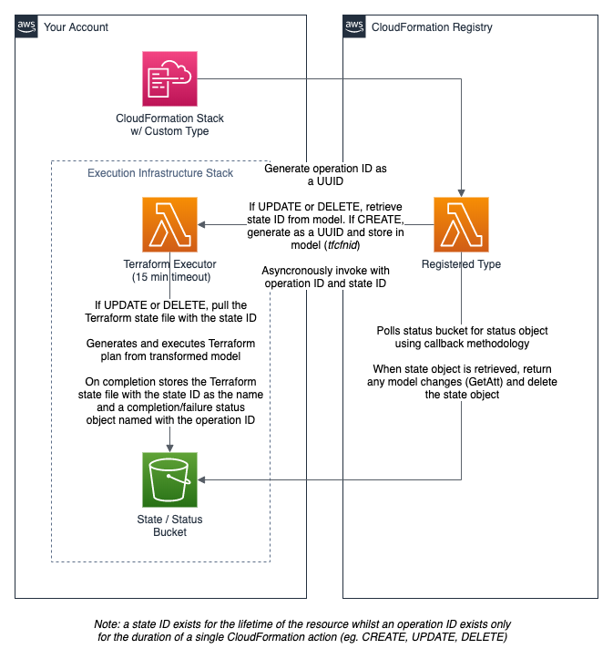

# CloudFormation Custom Types for Terraform

[](docs/README.md)

> Deploy over 3,000 new resource types with CloudFormation custom types.


:exclamation: **CAUTION:** This project is currently in beta stages. Some resources may not work as expected. Please [report these](https://github.com/iann0036/cfn-tf-custom-types/issues) if you find them.


## Requirements

The below requirements must be installed and be available in PATH:

* Python 3
* Git
* Terraform
* CloudFormation CLI with Python Provider

## Installation

### Execution Infrastructure

[](https://console.aws.amazon.com/cloudformation/home?region=us-east-1#/stacks/new?stackName=tfcfn-custom-type-resources&templateURL=https://s3.amazonaws.com/ianmckay-us-east-1/cfn-tf-custom-types/template.yml)

Click the above link to deploy the stack to your environment. This stack creates a single bucket in your account for the storage of state data, as well as a Lambda function that is used to execute the Terraform actions.

If you prefer, you can also manually upsert the [template.yml](https://github.com/iann0036/cfn-tf-custom-types/blob/master/template.yml) stack from source.

### Resource Generation

To generate the custom type source files, run:

```
python3 generate.py <providername>
# For example:
python3 generate.py aws
```

Note that generating all files may take several minutes depending upon the amount of resources the provider has.

You can also use `all` as the provider name to generate resources for all providers. Note this can take 20 minutes or more to complete.

### Resource Submission

Once you have generated the required resource files, you can submit the type to the CloudFormation registry by running the following:

```
python3 submit.py <resourcename>
# For example:
python3 submit.py Terraform::AWS::Instance
```

Note that resource submission will also generally take several minutes.

### Resource Usage

Most providers will require you to store credentials and/or other provider-specific settings within AWS Secrets Manager in order to access their services, generally in the secret name format **terraform/_provider-name-lowercase_**. For the AWS provider only, the resources permissions will suffice, however you may choose to override those values in the secret.

A full list of documentation can be found [here](docs/README.md).

You can use a submitted resource like any other CloudFormation native resource, provided you follow the appropriate documentation. Check out some of the [examples](https://github.com/iann0036/cfn-tf-custom-types/tree/master/examples) to get started.

## How It Works



## Acknowledgements

This project would not be possible without the work from the contributors to Terraform providers and the Terraform core product.
